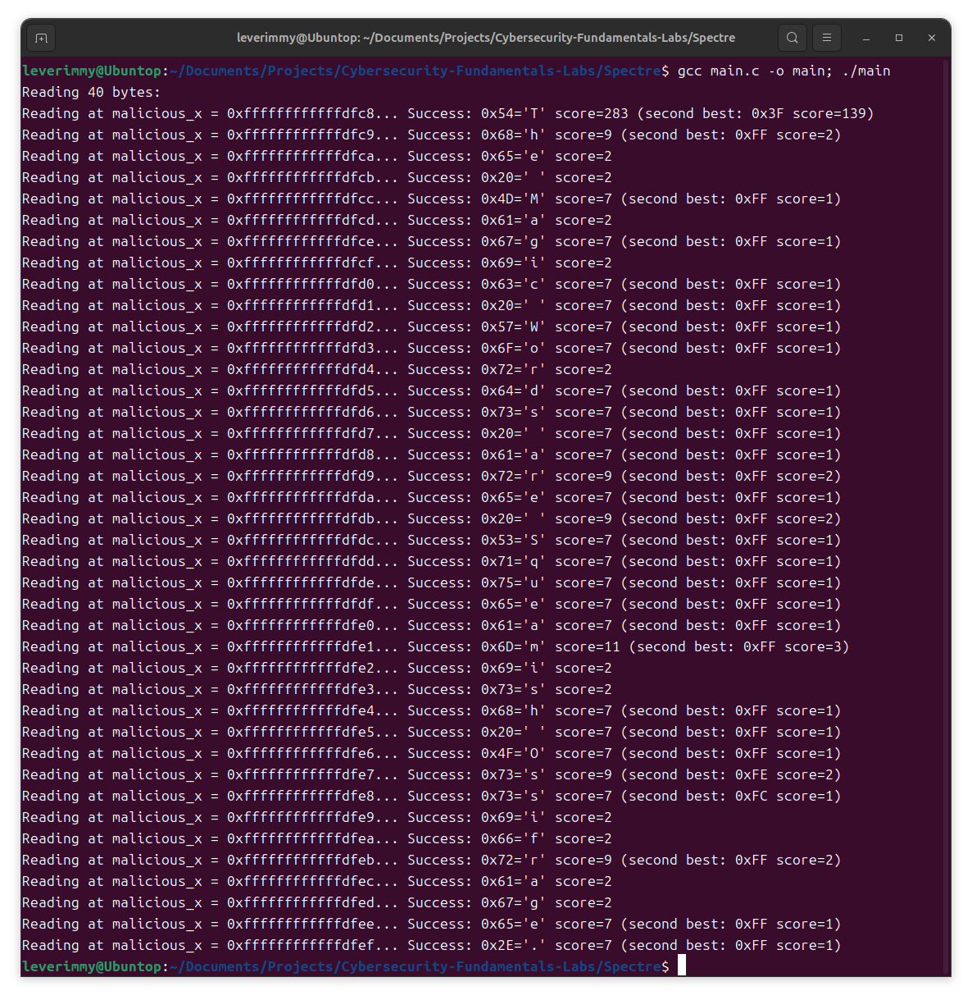

# 实验五：Spectre 攻击验证

## 实验步骤

### 准备工作

- 定义好需要用到的几个数组，包括存放敏感数据的 `secret`，模拟正常访问的数据数组 `array1`，以及用来做缓存攻击的 `array2`。
- 准备了一个 `results` 数组，用来记录每次攻击中各个 ASCII 码被猜中的次数。

### 确定攻击目标

把 `secret` 的地址减去 `array1` 的地址，得到一个偏移量 `malicious_x`，这样在后面越界访问的时候，就能通过 `array1` 直接访问到 `secret` 的内容。

### 清空缓存

为了让探测更准确，先用 `_mm_clflush` 指令清空 `array2` 的缓存，同时也清掉 `array1_size` 的缓存，避免分支预测提前使用缓存数据。

### 训练分支预测器

- 接下来，多次使用合法索引（0到15之间的数字）调用 `victim_function(x)`，让 CPU 习惯性地预测 “索引一定是合法的”。
- 然后，每 5 次正常调用后，使用 1 次越界的 `malicious_x` 调用 `victim_function(x)`。本来函数里并不应该进入分支，但由于分支预测，CPU 会访问到本不该访问的 `secret` 数据，并存入缓存。

### 测量缓存访问时间

- 在完成越界访问后，遍历 `array2` 的每一个可能位置，通过读取并测量访问时间，判断哪些数据已经被加载到缓存中了。
- 如果某个位置的访问时间很短，就说明它很可能是刚才被访问过的。

### 统计猜测结果

- 把每次探测到的结果记录下来，统计每个字节被命中的次数。
- 次数最多的那个字节，很可能就是 `secret` 当前要泄露的字符。

### 逐字节恢复 `secret`

- 每泄露一个字节，就把 `malicious_x` 往后移动一位，继续攻击下一个字节。
- 通过循环这个过程，就能把整个 `secret` 字符串一点点恢复出来。

## 实验截图

编译并运行 Spectre 程序：

```bash
gcc main.c -o main
./main
```

得到的结果如下图所示



结果说明 `secret[]` 为 `"The Magic Words are Squeamish Ossifrage."`，攻击成功。

## 参考资料

[Spectre Attacks: Exploiting Speculative Execution](https://ieeexplore.ieee.org/abstract/document/8835233)
