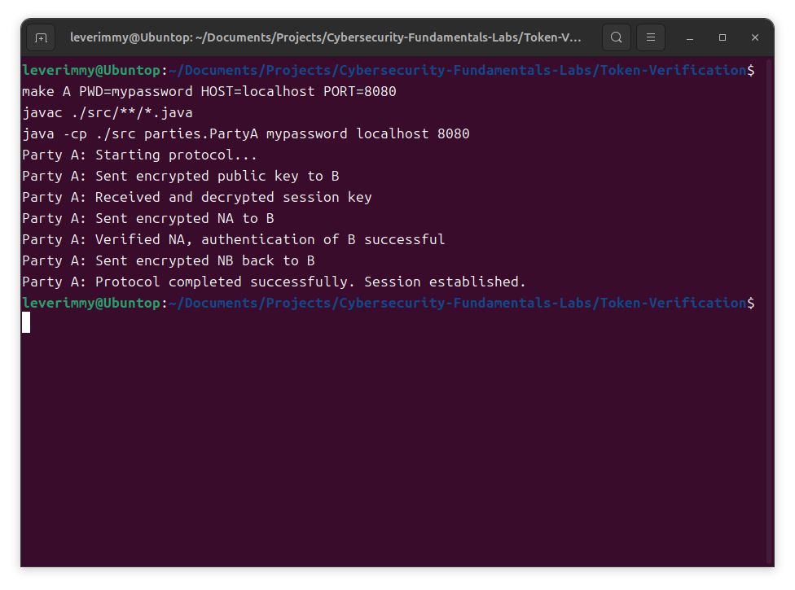
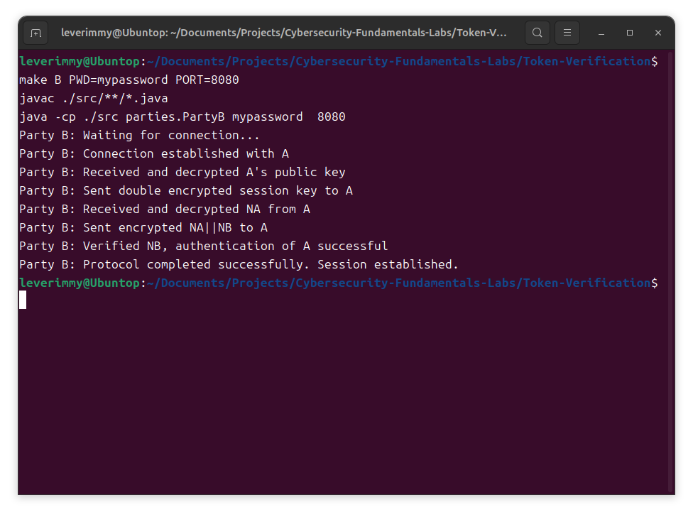
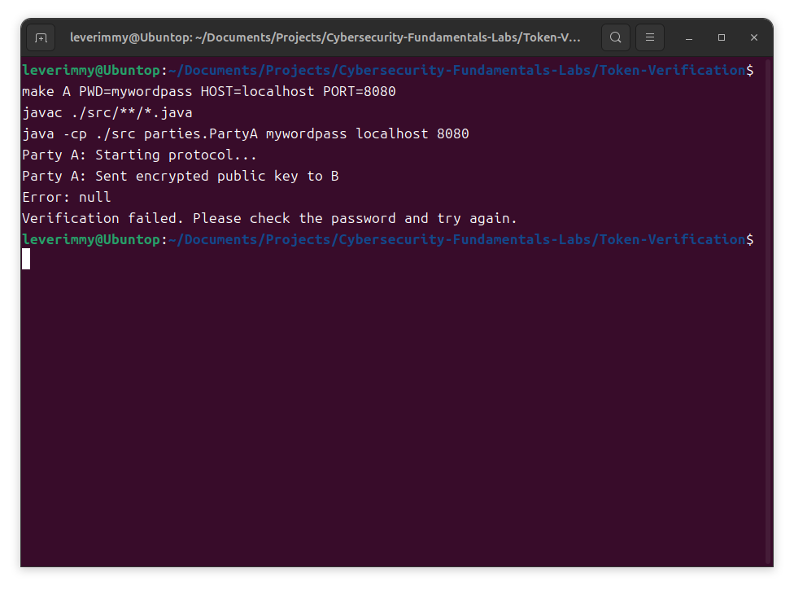
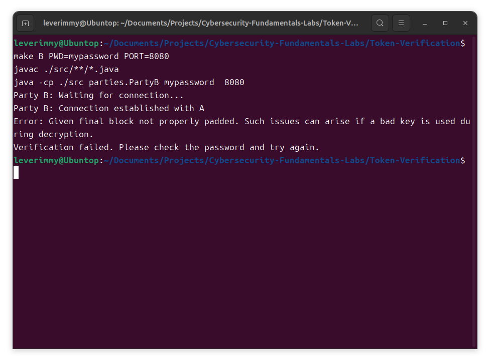

# 实验二：基于口令的安全身份认证协议

## 实验步骤

### 启动 B

运行 B，作为服务端监听来自 A 的连接请求：

```bash
make B PWD=mypassword PORT=8080
```

### 启动 A

运行 A，作为客户端连接到 B：

```bash
make A PWD=mypassword HOST=localhost PORT=8080
```

### 交互过程

#### 步骤 1：A 向 B 发起认证请求

- A 随机生成一对新的公钥和私钥 `(pkA, skA)`，用于公钥加密方案 E。
- A 向 B 发送自己的身份标识以及用 `pw` 加密后的 `pkA` 的密文，即发送消息 `AES(pw, pkA)`。

#### 步骤 2：B 接收并响应

- B 接收到消息后，使用 `pw` 解密密文，得到 `pkA`。
- B 随机生成会话密钥 `Ks`，并将经过两重加密后的密文发送给 A，即发送消息 `AES(pw, RSA(pkA, Ks))`。

#### 步骤 3：A 解密并生成随机数

- A 接收到消息后，使用 `pw` 和 `skA` 解密得到 `Ks`。
- A 生成随机数 `NA`，用 `Ks` 加密 `NA`，并将密文发送给 B，即发送消息 `DES(Ks, NA)`。

#### 步骤 4：B 解密并生成响应

- B 接到消息后，使用 `Ks` 解密得到 `NA`。
- B 生成随机数 `NB`，然后用 `Ks` 加密 `NA||NB`，并将密文发送回 A，即发送消息 `DES(Ks, NA||NB)`。

#### 步骤 5：A 验证并响应

- A 接收到消息后，使用 `Ks` 解密得到两个随机数的明文：`N = N1||N2`。
- A 验证其中的随机数 `N1` 是否与 `NA` 相等。如果相等，则判定对方确实是 B。
- A 使用 `Ks` 加密另一个随机数 `N2`，并将密文发送给 B，即发送消息 `DES(Ks, N2)`。

#### 步骤 6：B 验证并完成认证

- B 接到消息后，使用 `Ks` 解密得到 `N2`。
- B 验证 `N2` 是否与 `NB` 相等。如果相等，则判定对方确实是 A，认证结束。
- A 和 B 采用 `Ks` 作为共享的对称密钥进行后续通信。

## 实验截图

如果两者的密码相等（例如，均为 `mypassword`），则运行结果如下：

| A | B |
|:-:|:-:|
|| |

可以发现二者能够正常建立连接。

如果两者的密码不等（例如，A 为 `mywordpass`，B 为 `mypassword`），则运行结果如下：

| A | B |
|:-:|:-:|
|| |

则二者不能正常建立连接。
